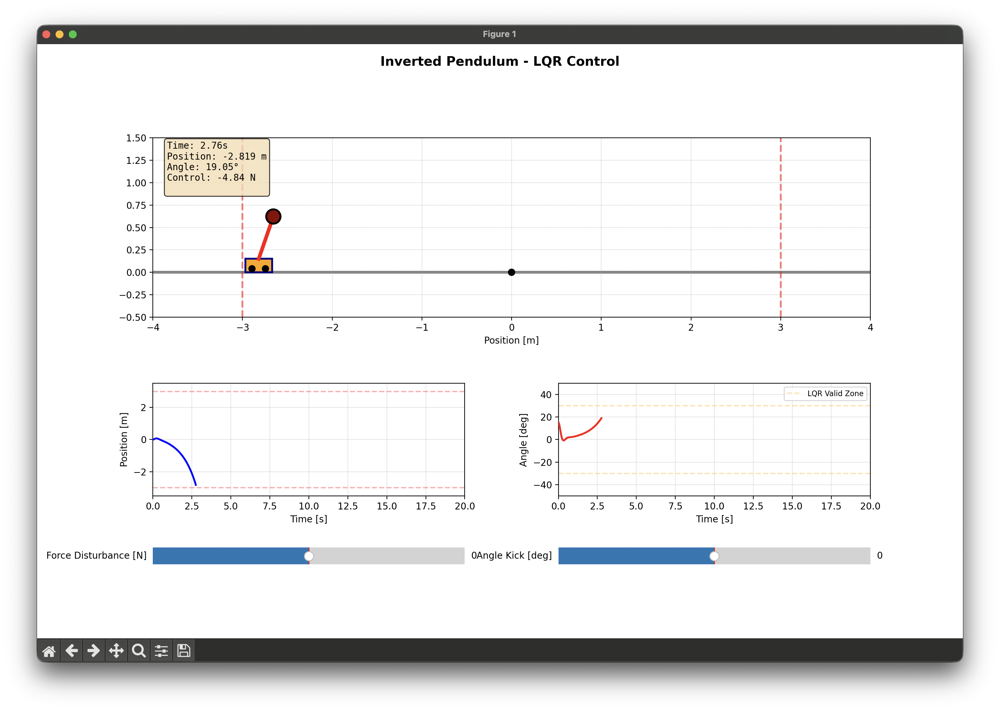
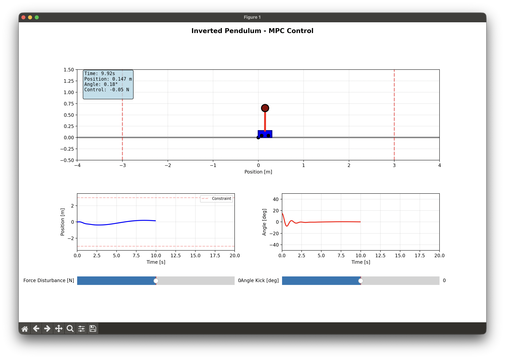
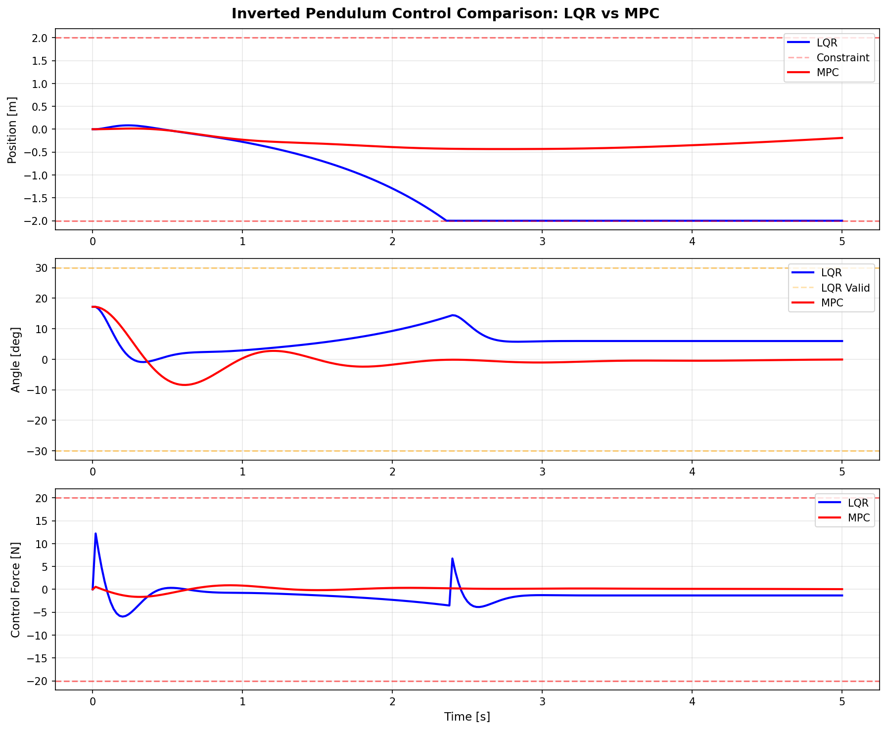
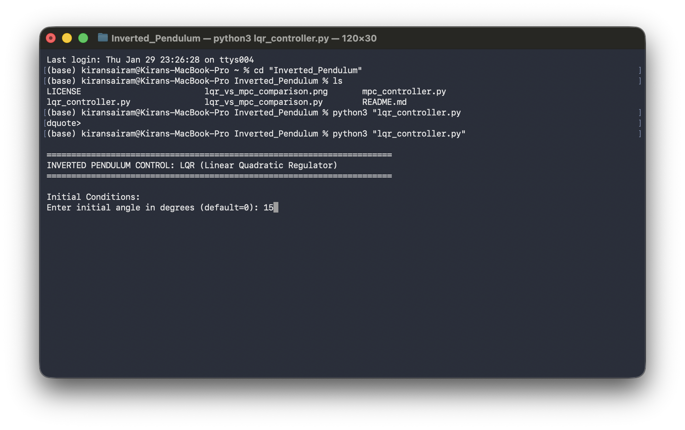
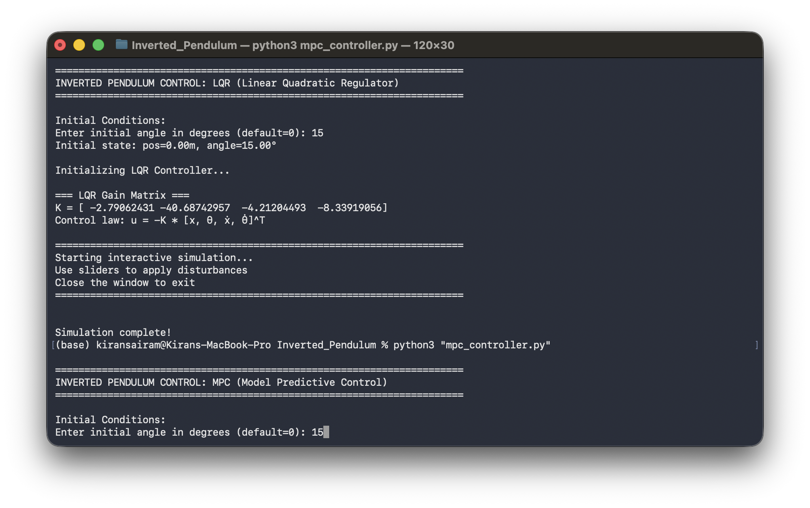

# Inverted Pendulum Control: LQR vs MPC

An interactive comparison of Linear Quadratic Regulator (LQR) and Model Predictive Control (MPC) for stabilizing an inverted pendulum on a cart. This project demonstrates the fundamental differences between linear and nonlinear control approaches through real-time visualization.


## Overview

The inverted pendulum is a classic control theory problem that serves as a benchmark for testing control algorithms. This project implements two fundamentally different approaches:

- **LQR (Linear Quadratic Regulator)**: Optimal control for linearized systems, fast but limited to small deviations
- **MPC (Model Predictive Control)**: Handles full nonlinear dynamics with explicit constraint satisfaction

## Demo

### LQR Controller in Action

*LQR efficiently stabilizes the pendulum near equilibrium but struggles with large angle deviations beyond 30°*

### MPC Controller in Action  

*MPC robustly handles large disturbances and explicitly respects position constraints*

### Side-by-Side Comparison

*Direct comparison showing position, angle, and control effort for both controllers*

### Terminal Interface
**LQR Terminal Output**


**MPC Terminal Output**

*Interactive prompts for initial conditions and real-time controller parameters*

## Features

### Interactive Real-Time Simulation
- Live animation of cart-pole system responding in real-time
- Disturbance injection via interactive sliders:
  - Force disturbances: ±10N
  - Angle kicks: ±30°
- Visual feedback: cart color changes when approaching track limits
- Real-time position and angle tracking plots

### LQR Controller
- Optimal linear control based on discrete algebraic Riccati equation (DARE)
- Automatic swing-up mode for large angle deviations (>30°)
- Computation time: ~10 microseconds per control cycle
- Visual indicators showing validity region where linearization holds

### MPC Controller
- Full nonlinear dynamics prediction over receding horizon
- Explicit state and input constraint handling
- Warm-start optimization for real-time performance
- Solver: `scipy.optimize` with SLSQP
- Prediction horizon: 20 steps (0.4 seconds lookahead)
- Computation time: ~5-10 milliseconds per control cycle

## Installation

### Prerequisites
```bash
Python 3.8+
```

### Dependencies
```bash
pip install numpy matplotlib scipy
```

Or install from requirements file:
```bash
pip install -r requirements.txt
```

## Usage

### Running LQR Controller
```bash
python3 lqr_controller.py
```

### Running MPC Controller
```bash
python3 mpc_controller.py
```

### Interactive Prompts
When you run either controller:
```
Enter initial angle in degrees (default=0):
```
- Press **Enter** for default (0°, upright position)
- Enter a value like `5`, `10`, or `20` to start with an initial angle

### Using the Interface

**Force Disturbance Slider** (bottom left)
- Applies continuous force to the cart
- Range: -10N to +10N
- Tests steady-state disturbance rejection

**Angle Kick Slider** (bottom right)
- Instantly perturbs the pendulum angle
- Range: -30° to +30°
- Tests transient response and recovery

**Real-Time Plots**
- Position vs. time (with track limit indicators)
- Angle vs. time (with LQR validity zone markers)
- Auto-scrolling after 20 seconds

## Mathematical Background

### System Dynamics

The cart-pole system is modeled with full nonlinear dynamics.

**State Vector**: `x = [position, angle, velocity, angular_velocity]ᵀ`

**Nonlinear Equations of Motion**:
```
ẍ = (u + ml(θ̇² + g·cos(θ))·sin(θ) - b·ẋ) / (M + m·sin²(θ))

θ̈ = (-u·cos(θ) - ml·θ̇²·cos(θ)·sin(θ) - (M+m)g·sin(θ) + b·ẋ·cos(θ)) / (l(M + m·sin²(θ)))
```

**System Parameters**:
- `M = 1.0 kg` - Cart mass
- `m = 0.3 kg` - Pendulum mass
- `l = 0.5 m` - Pendulum length
- `g = 9.81 m/s²` - Gravity
- `b = 0.1` - Friction coefficient
- Track limits: ±3.0 m
- Force limits: ±20 N

### LQR Controller

**Linearization** around upright equilibrium (θ = 0):
```
ẋ = Ax + Bu
```

**Cost Function**:
```
J = Σ(xᵀQx + uᵀRu)
```

**Optimal Gain** computed by solving the Discrete Algebraic Riccati Equation (DARE):
```
P = AᵀPA - AᵀPB(R + BᵀPB)⁻¹BᵀPA + Q
K = (BᵀPB + R)⁻¹BᵀPA
```

**Control Law**: `u = -Kx`

**Cost Weights**:
- `Q = diag([10, 100, 1, 1])` - Heavy penalty on angle deviation
- `R = 1` - Control effort penalty

**Energy-Based Swing-Up** (activated when |θ| > 30°):
```
E = ½ml²θ̇² - mgl·cos(θ)
u = k_E(E - E_desired)·sign(θ̇·cos(θ)) - k_d·ẋ
```

### MPC Controller

**Optimization Problem** (solved at each timestep):
```
minimize: Σ(xₖᵀQxₖ + uₖᵀRuₖ)
subject to: xₖ₊₁ = f(xₖ, uₖ)  [nonlinear dynamics]
            |x| ≤ x_max        [position constraint: ±3m]
            |u| ≤ u_max        [input constraint: ±20N]
```

**Implementation Details**:
- Solver: Sequential Least Squares Programming (SLSQP)
- Warm-started with previous solution (shifted by one timestep)
- Maximum iterations: 10
- Convergence tolerance: 1e-4
- Prediction horizon: N = 20 steps (0.4 seconds)

**Cost Weights**:
- `Q = [10, 100, 1, 1]` - State penalties (same as LQR for fair comparison)
- `R = 1` - Input penalty

## Performance Comparison

| Metric | LQR | MPC |
|--------|-----|-----|
| **Computation Time** | ~10 μs | ~5-10 ms |
| **Handles Large Angles** | No (switches to swing-up) | Yes |
| **Constraint Handling** | Hard clipping | Explicit in optimization |
| **Optimality** | Yes (near equilibrium) | Yes (over horizon) |
| **Implementation Complexity** | Simple | Complex |
| **Real-Time Capable** | Yes (kHz rate) | Yes (100-200 Hz rate) |

### When to Use Each Controller

**Use LQR when:**
- System naturally stays near equilibrium
- Fast, high-rate control loops required (>1kHz)
- Simple implementation is desired
- Constraints are not critical
- Computational resources are limited

**Use MPC when:**
- System has hard constraints (workspace limits, actuator saturation)
- Dynamics are highly nonlinear
- Need to optimize over future trajectory
- Acceptable computation time (~10ms per control cycle)
- Want to handle multiple objectives explicitly

## Configuration

### Modifying System Parameters

Edit the `PendulumParams` class:
```python
class PendulumParams:
    def __init__(self):
        self.M = 1.0        # Cart mass [kg]
        self.m = 0.3        # Pendulum mass [kg]
        self.l = 0.5        # Pendulum length [m]
        self.x_max = 3.0    # Track limit [m]
        self.u_max = 20.0   # Force limit [N]
        self.dt = 0.02      # Time step [s]
```

### Tuning LQR

Adjust state and input weights:
```python
Q_lqr = np.diag([q_x, q_theta, q_xdot, q_thetadot])
R_lqr = np.array([[r_u]])
```

**Tuning Guidelines**:
- Increase `q_theta` for faster angle correction
- Increase `q_x` to keep cart near center
- Increase `r_u` for smoother, less aggressive control
- Typical ranges: Q entries [1-1000], R [0.01-10]

### Tuning MPC

```python
Q_mpc = [q_x, q_theta, q_xdot, q_thetadot]  # State weights
R_mpc = r_u                                   # Input weight
N_horizon = 20                                # Prediction horizon
```

**Tuning Guidelines**:
- Longer horizon → better long-term planning, slower computation
- Higher state weights → more aggressive state regulation
- Lower input weight → more control effort allowed
- Typical horizon: 10-30 steps

## Troubleshooting

### Simulation runs slowly
- **MPC**: Reduce prediction horizon (try `N_horizon = 10`)
- **Both**: Close other applications using system resources

### Controller fails to stabilize
- Verify initial angle is reasonable for LQR (<20°)
- Check constraint limits are appropriate for the system
- Increase MPC horizon for difficult scenarios
- Ensure disturbance sliders are at zero initially

### `NameError: name 'angle_deg' is not defined`
- Delete Python bytecode cache: `rm -rf __pycache__`
- Verify the file is the latest version
- Check that user input section is present in `main()`

### Animation is jerky or laggy
- Reduce `max_hist` in `InteractiveSimulation` class
- Close other matplotlib windows
- Restart Python interpreter

## Key Insights

### Why LQR Fails at Large Angles

LQR designs control by linearizing the system around the upright position, assuming:
- `sin(θ) ≈ θ` (small angle approximation)
- `cos(θ) ≈ 1`

When θ becomes large (>30°), these approximations break down completely. The linear model no longer represents the true system, and the controller continues using an invalid model, leading to poor performance or failure.

**Solution**: Automatically switch to energy-based swing-up control for large angles.

### Why MPC is More Robust

MPC uses the full nonlinear dynamics `f(x,u)` in its optimization, eliminating reliance on linearization assumptions. Key advantages:

1. **Constraint Awareness**: MPC explicitly accounts for position limits in its cost function, "seeing" when it's approaching boundaries
2. **Predictive Planning**: The receding horizon allows planning ahead to avoid problematic states
3. **Adaptive**: Each optimization adapts to the current state without assuming small deviations
4. **Multi-Objective**: Can balance multiple objectives (stability, constraint satisfaction, control effort) simultaneously

### The Computational Trade-off

**LQR**: Control is a pre-computed matrix multiplication `u = -Kx`
- Gain K is computed offline by solving DARE once
- Online computation is trivial (~microseconds)

**MPC**: Solves a constrained optimization problem at every timestep
- Uses warm-starting to speed up convergence
- Still ~1000x slower than LQR, but fast enough for real-time control

This explains why LQR is preferred for ultra-fast control loops, while MPC is used when constraints and nonlinearity matter more than raw speed.

### Suggested Experiments

1. **Disturbance Rejection Test**
   - Apply increasing force disturbances to both controllers
   - Measure at what disturbance level each controller fails
   - Compare recovery time after disturbance is removed

2. **Initial Condition Sensitivity**
   - Test with initial angles from 0° to 30°
   - Plot settling time vs. initial angle for both controllers
   - Identify where LQR performance significantly degrades

3. **Constraint Violation Analysis**
   - Reduce track limits to `x_max = 1.5m`
   - Observe how each controller adapts
   - Count constraint violations for aggressive disturbances

4. **Parameter Uncertainty Robustness**
   - Change pendulum mass or length in simulation
   - Keep controller gains fixed
   - Test which controller is more robust to model mismatch

5. **Computational Load Testing**
   - Vary MPC horizon from 5 to 50 steps
   - Measure computation time vs. control performance
   - Find optimal horizon for real-time constraints

## File Structure

```
Inverted_Pendulum/
├── lqr_controller.py              # LQR implementation with interactive GUI
├── mpc_controller.py              # MPC implementation with interactive GUI
├── lqr_vs_mpc_comparison.py      # Side-by-side comparison tool
├── images/                        # Screenshots and visualizations
│   ├── lqr_controller_image.png
│   ├── mpc_controller_image.png
│   ├── lqr_vs_mpc_comparison.png
│   ├── terminal_lqr.png
│   └── terminal_mpc.png
├── README.md                      # This file
└── LICENSE                        # MIT License
```

## Potential Improvements

- Implement trajectory tracking (follow desired position profiles)
- Add other controllers (H∞, sliding mode, adaptive control)
- Include state estimation (Kalman filter for noisy measurements)
- Create 3D visualization option
- Add data export for post-processing and analysis
- Implement disturbance observer
- Add comparison with other nonlinear control methods

## References

### Books
- Åström, K. J., & Murray, R. M. (2008). *Feedback Systems: An Introduction for Scientists and Engineers*. Princeton University Press.
- Rawlings, J. B., Mayne, D. Q., & Diehl, M. (2017). *Model Predictive Control: Theory, Computation, and Design* (2nd ed.). Nob Hill Publishing.

### Papers
- Anderson, B. D., & Moore, J. B. (1990). *Optimal Control: Linear Quadratic Methods*. Dover Publications.
- Mayne, D. Q., et al. (2000). "Constrained model predictive control: Stability and optimality." *Automatica*, 36(6), 789-814.

## License

This project is licensed under the MIT License - see the [LICENSE](LICENSE) file for details.

## Contact

Kiran Sairam - [GitHub](https://github.com/Kiran1510)

---

**If you found this project useful, please consider giving it a star!**
